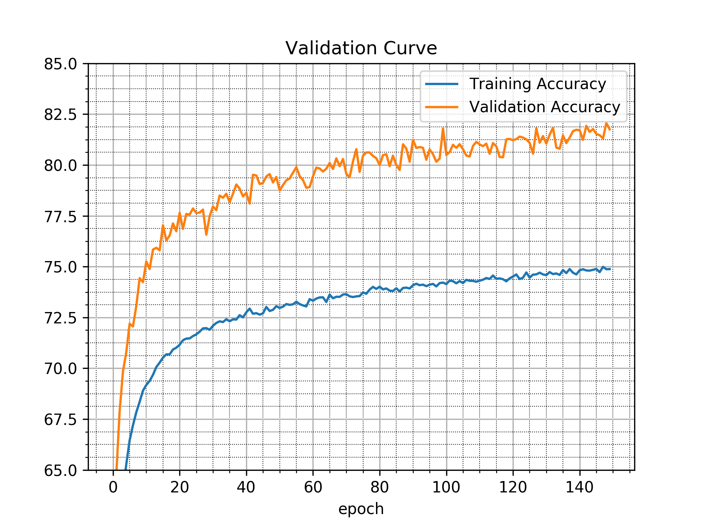

## Purpose

This is copied from `01-keras-basic`. You can notice that there was quite a bit
of overfitting: The final test accuracy is 69.49%, but after epoch 4 it was
already at 70.61% training accuracy and in epoch 150 it was at 91.37% training
accuracy.

This time, I add dropout and I log the training accuracy, the validation
accuracy and the test accuracy in a CSV. I want to create a validation curve
(see [Subsection 2.5.3: Validation Curves: Accuracy, loss and other metrics](https://arxiv.org/pdf/1707.09725.pdf))


## Results

The test accuracy improved from 69.49% to 74.18% just by adding dropout!



One can see that after about 30 epochs most of the training is done, but even
after 150 epochs the training did not finish. So increasing the number of
epochs could be valuable.

```
time python3 main.py
Using TensorFlow backend.
Train on 151241 samples, validate on 151241 samples
Epoch 1/150
2018-11-03 10:13:44.807688: I tensorflow/core/platform/cpu_feature_guard.cc:140] Your CPU supports instructions that this TensorFlow binary was not compiled to use: AVX2 FMA
2018-11-03 10:13:44.916352: I tensorflow/stream_executor/cuda/cuda_gpu_executor.cc:898] successful NUMA node read from SysFS had negative value (-1), but there must be at least one NUMA node, so returning NUMA node zero
2018-11-03 10:13:44.917270: I tensorflow/core/common_runtime/gpu/gpu_device.cc:1356] Found device 0 with properties: 
name: GeForce 940MX major: 5 minor: 0 memoryClockRate(GHz): 1.2415
pciBusID: 0000:02:00.0
totalMemory: 1.96GiB freeMemory: 1.50GiB
2018-11-03 10:13:44.917290: I tensorflow/core/common_runtime/gpu/gpu_device.cc:1435] Adding visible gpu devices: 0
2018-11-03 10:13:46.593804: I tensorflow/core/common_runtime/gpu/gpu_device.cc:923] Device interconnect StreamExecutor with strength 1 edge matrix:
2018-11-03 10:13:46.595811: I tensorflow/core/common_runtime/gpu/gpu_device.cc:929]      0 
2018-11-03 10:13:46.595853: I tensorflow/core/common_runtime/gpu/gpu_device.cc:942] 0:   N 
2018-11-03 10:13:46.596847: I tensorflow/core/common_runtime/gpu/gpu_device.cc:1053] Created TensorFlow device (/job:localhost/replica:0/task:0/device:GPU:0 with 1270 MB memory) -> physical GPU (device: 0, name: GeForce 940MX, pci bus id: 0000:02:00.0, compute capability: 5.0)
151241/151241 [==============================] - 16s 108us/step - loss: 2.7992 - acc: 0.4067 - val_loss: 1.7318 - val_acc: 0.5830
Epoch 2/150
[...]
Epoch 150/150
151241/151241 [==============================] - 14s 91us/step - loss: 0.8309 - acc: 0.7488 - val_loss: 0.5683 - val_acc: 0.8175
16992/16992 [==============================] - 1s 40us/step

acc: 74.18%

real    2193,24s
user    2353,14s
sys    457,63s
```
