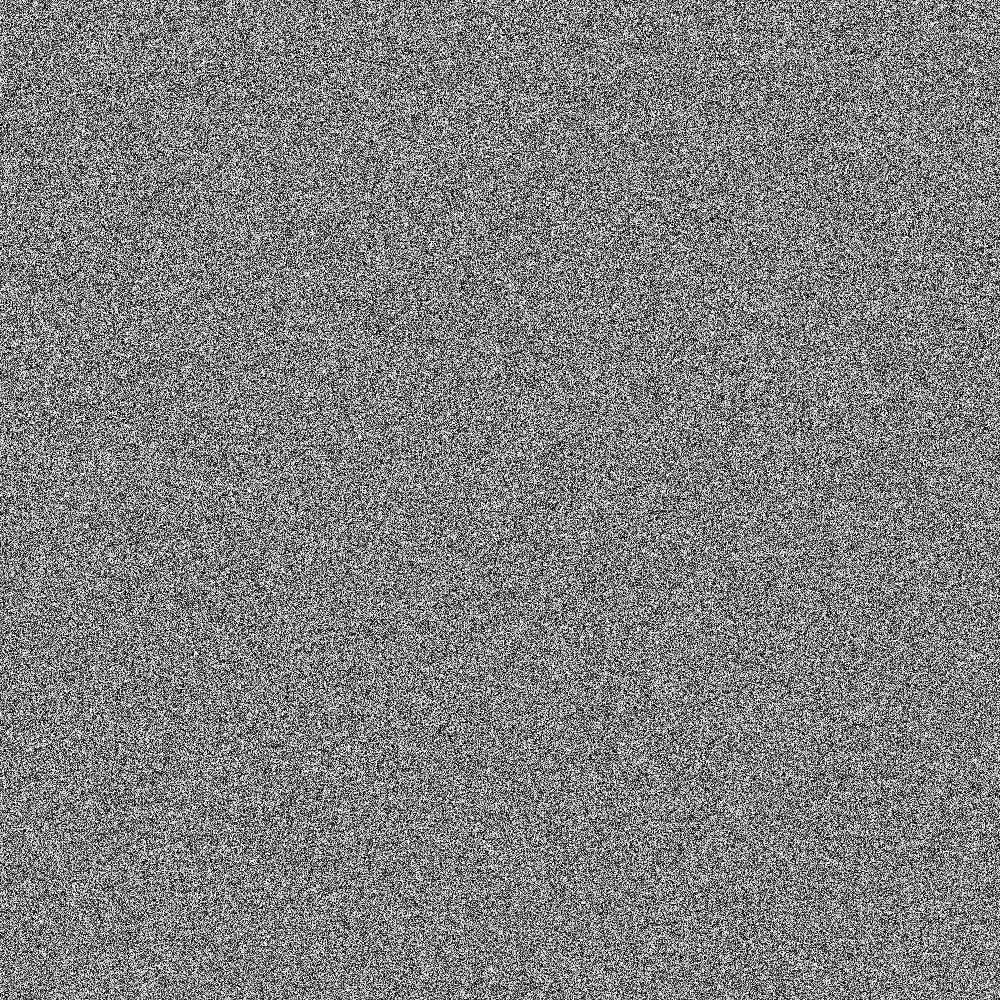

This script was created in order to see if Pythons seed leads to somehow biased
random numbers, similar as [Java
does](https://stackoverflow.com/q/12282628/562769).

On the x-axis, there are 1000 different seeds. On the y-axis, there are the first
1000 numbers:



The first few numbers:

```
seed run_1 run_2
0    0.8444218515250481    0.7579544029403025
1    0.13436424411240122    0.8474337369372327
2    0.9560342718892494    0.9478274870593494
3    0.23796462709189137    0.5442292252959519
4    0.23604808973743452    0.1031660342307158
5    0.6229016948897019    0.7417869892607294
6    0.793340083761663    0.8219540423197268
7    0.32383276483316237    0.15084917392450192
8    0.2267058593810488    0.9622950358343828
9    0.46300735781502145    0.37331193139504204
...
990    0.8128716461498516    0.040372988033022805
991    0.1472884078342933    0.6557204141040517
992    0.9761786177666265    0.3657243162279661
993    0.06149001353559502    0.0823572363409929
994    0.9482633853484476    0.7600141314627027
995    0.18178608134314445    0.2879549768691879
996    0.9154538064300086    0.4437849706606085
997    0.4656989831335083    0.29991547226698756
998    0.1648379600009785    0.9521280869957142
999    0.7813468849570298    0.0800656147037001
```