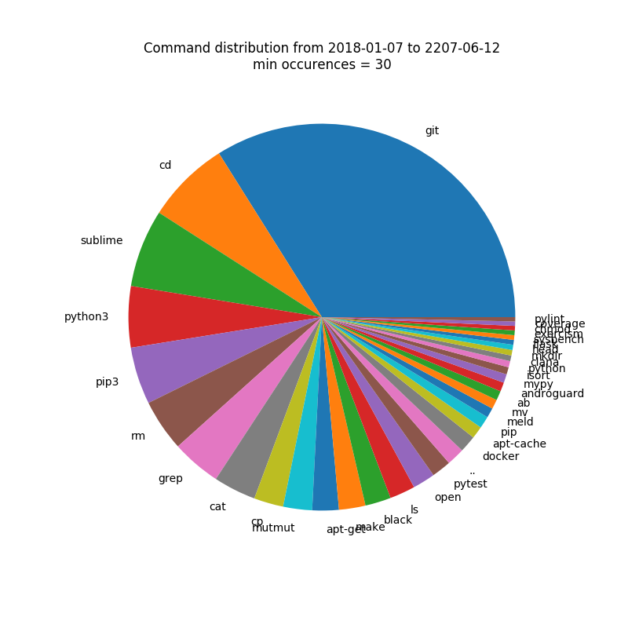

## How to Use

Get the history file:

```bash
$ history > history.txt
$ pip install -r requirements.txt --user

# You have to know which shell you have
# This is important, because the `history` command has different outputs in
# different shells.
# Fish shell has only the command itself as an output.
$ python analyze.py history.txt --shell bash
```


