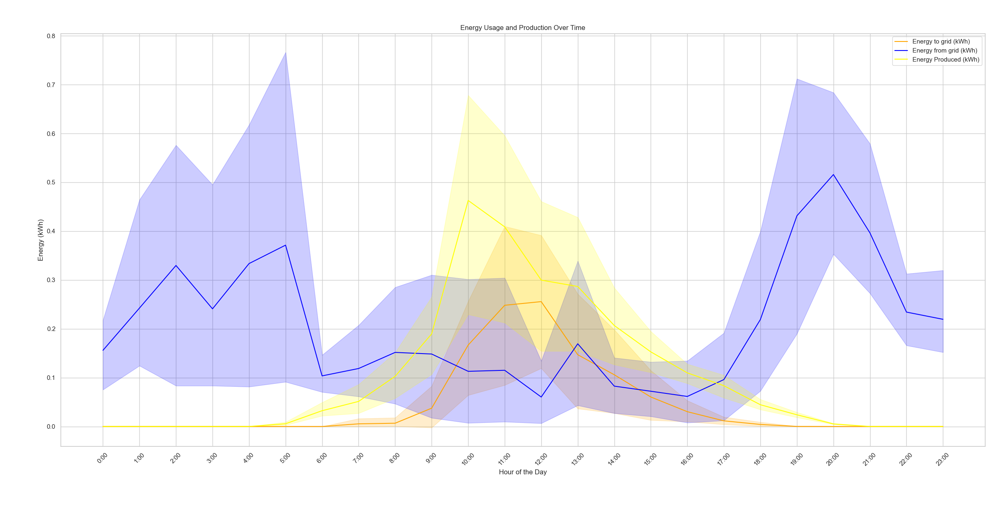

# Smart Home Sensor Data

Time is in local time (Berlin/Europe).

## Graphs

## Energy Usage

* It's a single-family house with two adults (sometimes four).
* Devices:
    * We have a heat pump for heating and hot water, but it has its own meter.
    * We have an AC which we use for heating that is part of this data
    * Kitchen:
        * Fridge+freezer combination (Samsung RL38C7B5BB1/EG; specs: 134kWh/year)
        * dishwasher (Bauknecht BBO 3O41 PLT; specs: 0.746kWh per run)
        * stove + oven
        * microwave, water cooker, and an air fryer
    * A washing machine, but no dryer.
    * To run this script, I let my T460p run all day, which is not typical.
    * A Fritz!Box 7530 router (Specs: 6W average)
    * A TV and a Nintendo Switch.
    * Several security cameras
    * Laptops, smarphones, a tablet.
* I have 1000Wp balcony solar panels with a maximum output of 800W. They produce about 650kWh per year.
* Behavior:
    * We typically eat warm dinner.
        * If my wife has a day-shift, I prepare the differ starting around 19:00.
        * If my wife has a night-shift, I prepare the dinner starting around 17:00.
        * If my wife has a free day, she prepares the dinner starting around 18:30.
    * We don't have a heater in the bathroom, so we use an electric heater there. Typically in the evening.
    * I was sick in the night of 2025-05-27 to 2025-05-28, so I used the electric heater in the bathroom during the night. I think I even slept there and forgot to turn it off.
    * In the night from 2025-05-24 to 2025-05-25 I forgot to turn off the oven. I noticed in the morning.
