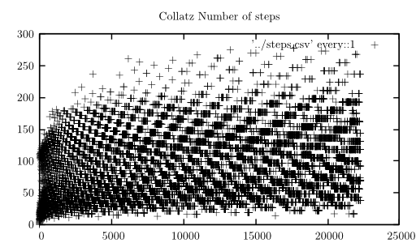
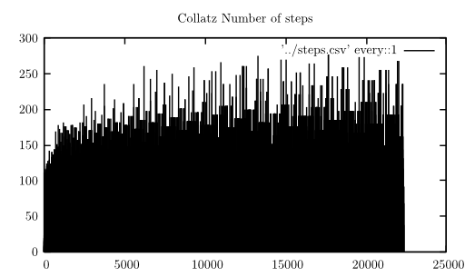

When you want to use this, you have to get a `steps.csv` first.
To get it, you can execute `make;./collatz.out > steps.csv` in the
folder above.

Scatter plot created with pgfplots and option `only marks`.
Created with 4100 data points, more than 4150 were not possible:

Comb plot created with pgfplots and 7150 data points. More than 7200
were not possible:

Comb plot created with pgfplots and 22300 data points. More than 22350
were not possible:

